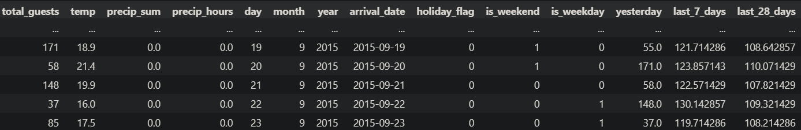

 

  

<h2 align="center"><b>Hotel guest demand prediction pipeline</b></h2> 

 
<h3 align="center"><b>Project description</b></h3>

This is an end-to-end machine learning pipeline with an exposed API and visual front-end. The goal of the model is to predict the expected amount of guests of a specific hotel based on two years of booking data. The original Kaggle can be found <a href="https://www.kaggle.com/datasets/jessemostipak/hotel-booking-demand"> here </a>. The booking data ranges from 2015-07-01 to 2017-07-01. We consider the last three months of this dataset (2017-04-01 to 2017-07-01) as the test set. 
  
<h3 align="cent"><b>Project components</b></h3>
<ul>
  <li align="left"> Data science & Feature engineering
    <ul>
      <li><a href="data/preprocessing.ipynb"> Preprocessing data </a></li>
      <li><a href="model.ipynb"> EDA & Modelling </a></li>
      </li>
    </ul>
  </li>
  <li align="left">Exposing model API through Flask
    <ul>
      <li><a href="endpoints.py"> Flask endpoints </a></li>
    </ul>
  </li>
    <li align="left"> Backend & Frontend .NET Core
    <ul>
      <li><a href="/blazor"> .NET Core Blazor </a></li>
       <ul>
      <li><a href="Blazor\Hotel Demand Blazor\Hotel Demand Blazor\Data\DemandService.cs"> API Service </a></li>
        <li><a href="Blazor\Hotel Demand Blazor\Hotel Demand Blazor\Pages\Index.razor"> Dashboard page</a></li>
      </ul>
    </ul>
  </li>
</ul>

  <h3 align='center'><b>Model information </b></h3>
The  <a href="model.ipynb"> modelling </a> of this project was done exclusively in Python using Jupyter Notebook, Tensorflow and a host of standard data science packages. The Kaggle data was combined by open source <a href="https://open-meteo.com/">weather data</a> of Lisbon during that same time period. Multiple models were implemented. Given the (time) serial nature of the booking data, the first model built was an LSTM. Results of this model were compared to a baseline model (mean guests), a DNN and a simple SVR model. The columns 'last_28' and 'last_7' are rolling averages of the specified previous span of days. 

  

  <h3 align='center'><b>Model exposure (Flask) </b></h3>
The model that performed best (DNN) was exported along with its fitted scaler and then exposed using <a href="endpoints.py"> the Flask endpoint </a> using a DTO-model based approach. The goal was to build an easily scalable set of endpoints that can easily be maintained or built upon.

  <h3 align='center'><b> Prediction dashboard and backend </b></h3>
The <a href="/blazor"> .NET backend </a> was written in .NET Core using Blazor and .NET Core WebAPI. The DemandService is injected into the dashboard and fetches sets of data used to draw the dashboard front-end. The Layout and graphing is handled by <a href="https://github.com/radzenhq/radzen-blazor"> Radzen Blazor </a> and the <a href="https://github.com/apexcharts/Blazor-ApexCharts"> Apexcharts Blazor wrapper </a>. Microsoft SQL Express is used for storing and retrieving the proprocessed and aggregated Kaggle data, but is not included in this project for ease of reproduction through the <a href="/data"> included .CSV data. </a>
