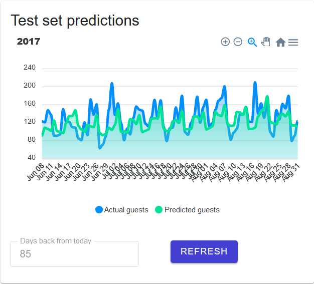

<br />
<div align="center">
  <a href="https://github.com/FransHk/Hotel-guest-demand-prediction">

  </a>

<h1 align="center"><b>Hotel guest demand prediction pipeline</b></h2></br>


</br>
<h2 align="center"><b>Project description</b></h3>
<p align="left">
This is an end-to-end machine learning pipeline with an exposed API and visual front-end. The goal of the model is to predict the expected amount of guests of a hotel based on two years of booking data. The original Kaggle entry can be found <a href="https://www.kaggle.com/datasets/jessemostipak/hotel-booking-demand"> here </a>. The corresponding hotel is located in Portugal and the booking data ranges from 2015-07-01 to 2017-07-01. This project serves as a end-to-end machine learning pipeline example and the total project duration was approximately two weeks. <b>The dashboard is currently not hosted, a high resolution screenshot of dashboard is available <a href="images/screen_3.png"> here. </a> </p></b>
<br><br>

<h2 align="center"><b>Project components</b></h3>

<b>Data science & Feature engineering: </b>
    <a href="data/preprocessing.ipynb"> Preprocessing data </a>, 
    <a href="model.ipynb"> EDA & Modelling </a>

<b>Exposing model API through Flask: </b>
<a href="endpoints.py"> Flask endpoints </a>

 <b>Backend & Frontend (.NET Core): </b>
 <a href="Blazor\Hotel Demand Blazor\Hotel Demand Blazor"> .NET Core Blazor </a>, 
 <a href="Blazor/Hotel Demand Blazor/Hotel Demand Blazor/Data/DemandService.cs"> API Service </a>,
 <a href="Blazor/Hotel Demand Blazor/Hotel Demand Blazor/Pages/Index.razor"> Dashboard page</a>
   
</p>
<br> <h2 align='center'><b>Model information </b></h3> <p align="left"> 
The  <a href="model.ipynb"> modelling </a> of this project was done exclusively in Python using Jupyter Notebook, Tensorflow and a host of standard data science packages. The Kaggle data was combined by open source <a href="https://open-meteo.com/">weather data</a> of Lisbon during that same time period. Multiple models were implemented. Given the (time) serial nature of the booking data, the first model built was an LSTM. Results of this model were compared to a baseline model (mean guests), a DNN and a simple SVR model. The columns 'last_28' and 'last_7' are rolling averages of the specified previous span of days. Multiple features were engineered, evaluated and added to the model. </p>

<br><br>

<br> <h3 align='center'><b>Model exposure (Flask) </b></h3> <p align="left">
The model that performed best (DNN) was exported along with its fitted scaler and then exposed using <a href="endpoints.py"> the Flask endpoint </a> using a DTO-model based approach. The goal was to build an easily scalable set of endpoints that can easily be maintained or built upon.</p>

```python
@app.route('/predict', methods=['POST'])
def predict():

    # Obtain model and scaler
    scaler = app.config['SCALER']
    model = app.config['MODEL']
    
    # Fetch input and reshape
    input_data = request.json['data']  
    input_data = np.array(input_data)  
    input_data = np.reshape(input_data, (-1, 8))  

    # Normalize input data using the scaler
    input_data_scaled = scaler.transform(input_data)
    prediction = model.predict(input_data_scaled)
    pred_item = prediction.tolist()[0]
    response = {'guest_ct' : pred_item}

    return jsonify(response)
```

<br> <h3 align='center'><b> Prediction dashboard and backend </b></h3> <p align="left">
The <a href="Blazor\Hotel Demand Blazor\Hotel Demand Blazor"> .NET backend </a> was written in .NET Core using Blazor and .NET Core WebAPI. The DemandService is injected into the dashboard and fetches sets of data used to draw the dashboard front-end. The Layout and graphing is handled by <a href="https://github.com/radzenhq/radzen-blazor"> Radzen Blazor </a> and the <a href="https://github.com/apexcharts/Blazor-ApexCharts"> Apexcharts Blazor wrapper </a>. Microsoft SQL Express + EF are used for storing and retrieving the proprocessed and aggregated Kaggle data, but is not included in this project for ease of reproduction through the <a href="/data"> included .CSV data. </a></p>

```html
<ApexChart TItem="Prediction"Title=@today.YearStr>

              <ApexPointSeries TItem="Prediction"
                  Items="predictionDataSubset" 
                  Name="Actual guests" 
                  XValue="@(e => e.Date.MonthDayStr)"
                  YValue="@(e => e.GuestCount)"
                  SeriesType="SeriesType.Area" />

              <ApexPointSeries TItem="Prediction"
                 Items="predictionDataSubset" 
                 Name="Predicted guests" 
                 XValue="@(e => e.Date.MonthDayStr)" 
                 YValue="@(e => e.Predicted)" 
                 SeriesType="SeriesType.Area" />
</ApexChart>                 
```

<br> <h3 align='center'><b> Model results </b></h3> <p align="left">
The model data is divided in 85/15 ratio. As such, the model is trained on approx. 645 days of data and tested on approx. 85 days. The baseline model (always guesses average guest count, 98) gets a MSE of approximately 3000-3200 on the test set. The best performing model (a DNN) has a MSE  of around 1050 instead. This MSE is surprisingly low considering that a broad range of external events that impact guest counts are not taken into account by the model (i.e. events, discounts and advertisements) and there is not a lot of data to work with. The full results are presented in the notebook <a href="model.ipynb"> here </a>. </p>

